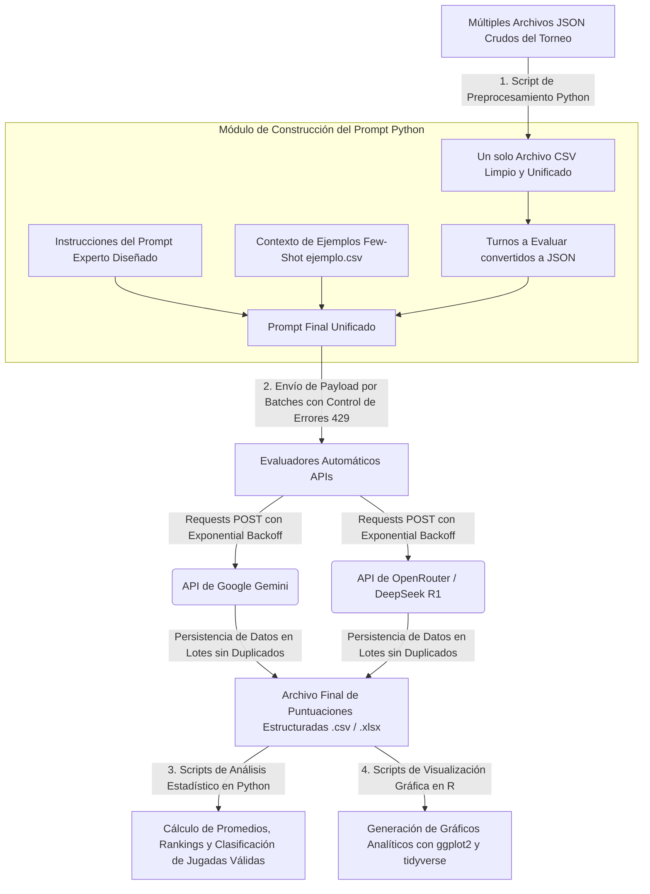

# Design of a Rubric to Evaluate LLM Interaction Performance in Board Games
An automated Python and R data engineering pipeline designed to benchmark, parse, and evaluate strategic reasoning, factuality, and rule compliance in frontier Large Language Models (LLMs) executing sequential actions within board game environments.

---

## Technical Authorship & Project Scope
*   **Core Engineering & Architecture:** Designed and implemented 100% of the software architecture, Python data pipelines, error-handling mechanisms, and R analytical scripts.
*   **Prompt Engineering & Rubric Design:** Individually conceptualized, tested, and deployed the advanced Few-Shot Prompting strategies, strict technical role constraints, and JSON payload structures used to govern the automated model evaluators based on a custom 7-dimensional framework.
*   **Data Source:** Developed the data pipelines to consume, parse, and clean an external pre-existing tournament gameplay dataset, transforming raw multi-turn logs into structured evaluation environments.

---

## System Architecture & Data Flow



---

## Repository Pipeline Architecture

### 1. Dataset Preprocessing Pipeline
*   **Data Normalization:** Automated Python workflow that aggregates and parses multi-file raw JSON tournament logs into a unified, clean tabular CSV format.
*   **Data Cleansing:** Sanitizes whitespace, strips formatting anomalies, and structures explicit turn-by-turn state tracking.
*   **Context Engineering:** Structures reference datasets (`ejemplos.csv`) utilized for target Few-Shot Prompting injections during evaluation.

### 2. Automated AI Evaluators (Gemini & DeepSeek)
*   **Programmatic Consumption:** Native integration of Google Gemini-2.0-Flash (`v1beta`) and OpenRouter (`deepseek/deepseek-r1:free`) APIs to act as automated metrics judges.
*   **Rate-Limit Resilience:** Implemented programmatic exponential backoff retry logic to gracefully handle HTTP 429 rate limits, preventing data loss during batch processing.
*   **Evaluation Engine:** Injects JSON-formatted board states, turn actions, and custom-engineered prompt structures into the model context to generate structured scoring across 7 dimensions.

### 3. Analytical Python Engines
*   Computes exact arithmetic averages grouped by dimension, evaluator, and target model.
*   Executes automated filtering to categorize valid vs. illegal board movements.
*   Performs structural cross-evaluator analysis to benchmark scoring alignment and identify evaluation model biases.
*   **Idempotency & Session Persistence:** Parses structural state records via unique key generation (`id_match_timestamp`) to dynamically bypass already processed matches and resume failed batch cycles without data duplication.

### 4. RStudio Statistical Visualization
*   **Tidyverse Pipeline:** Advanced data manipulation and reshaping scripts using R tidyverse.
*   **ggplot2 Analytics:** Generates visual representations of average response latency per target model, performance distribution profiles mapped across all 7 evaluation dimensions, and comparative Top 3 Best vs. Worst performing architectures under Gemini and DeepSeek criteria.

---

## Core Implementation Snippets

### Exponential Backoff Retry Logic (API Resilience Layer)
The pipeline manages HTTP 429 constraints natively by executing an automated retry loop with progressive waiting periods to guarantee asynchronous data ingestion:

```python
# Programmatic implementation of the rate-limit handler
backoff = initial_backoff
for attempt in range(1, max_retries + 1):
    response = requests.post(API_URL, headers=HEADERS, json=payload)
    if response.status_code == 429:
        print(f"Rate limit (429). Waiting {backoff}s before retry ({attempt}/{max_retries})...")
        time.sleep(backoff)
        backoff *= 2  # Exponential backoff scaling
        continue
    if response.status_code != 200:
        print("Response error:", response.status_code, response.text)
        break
    return response.json()
```

---

## 7-Dimensional Evaluation Rubric Framework
The evaluation architecture scores prompt-response interactions on a normalized scale from 1 (Deficient) to 3 (High) across seven independent metrics:

| Dimension | Level 1 – Deficient | Level 2 – Acceptable | Level 3 – High |
| :--- | :--- | :--- | :--- |
| **Rule Comprehension** | Violates fundamental rules (e.g., target cell occupied or out of bounds). | Adheres to core layout rules but fails minor edge-case logic. | Executes legal actions; consistently adheres to game rules. |
| **Validity & Legality** | Move is invalid or fundamentally out of game boundary constraints. | Move is mathematically valid but lacks deep positional value. | Move is completely valid and backed by deep operational board parsing. |
| **Strategic Reasoning** | Actions are chaotic, random, or counterproductive to the win condition. | Displays simple, reactive strategies (e.g., direct block/attack) without foresight. | Displays predictive foresight, maximizing win probability or defensive lockouts. |
| **Factuality** | Explanation contains hallucinations or misrepresents the current board state. | Explanation is structurally correct but exhibits minor factual imprecision. | Text output is completely factual and precisely mirrors the layout array. |
| **Explanatory Coherence**| Model reasoning is disjointed, chaotic, or explicitly contradicts the chosen action. | Explanation is clear but stays superficial to the operational choice. | Logic flow is coherent, comprehensive, and tightly coupled with the executed move. |
| **Linguistic Clarity** | Output contains breaking structural typos or severely flawed syntax. | Syntax is understandable with minor stylistic or grammatical anomalies. | Language is precise, grammatical, and easy to interpret by automated parsers. |
| **Adaptability** | Completely ignores the opponent's previous move or recent board state shifts. | Adapts reactively or late to changing board dynamics. | Optimizes strategy on the fly, actively responding to the opponent's strategy shifts. |

---

## Dependencies & Prerequisites

### Python Environment
*   `Python 3.x`
*   `pandas`
*   `requests`

### R Environment
*   `RStudio`
*   `tidyverse` (including `ggplot2`, `dplyr`, `readr`)
*   `readxl`

### Authentication Requirements
*   Valid API Credentials for Google Cloud (Gemini Engine) and OpenRouter (DeepSeek R1 Engine) configured via local environment variables.
